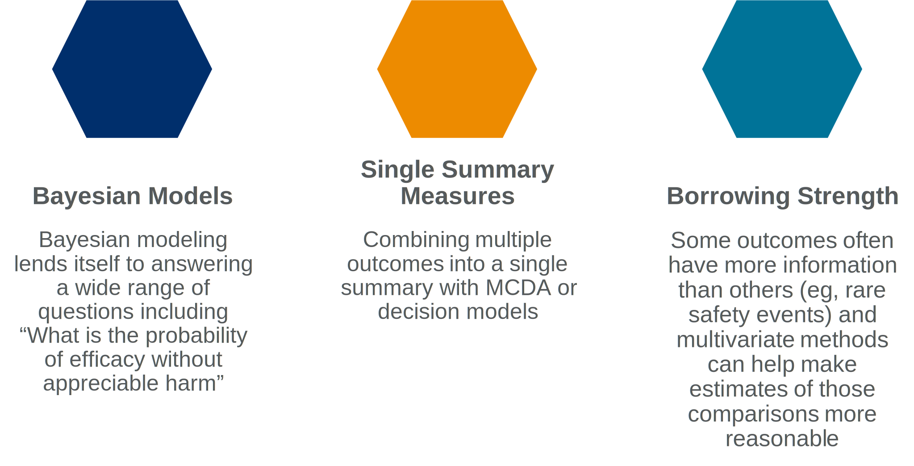

```{r setup, include=FALSE}
library(flexdashboard)
library(svglite)
library(dplyr)
devtools::load_all()
```

### Do consistent trends mean the sum is greater than its parts?

```{r, fig.width=8, dev = "svglite"}
tibble::tibble(x = paste("Outcome:",1:5),
           y = c(-2, -3, -1, 1,-1.5),
           lwr = y-3,
           upr = y+3) %>%
  ggplot2::ggplot(ggplot2::aes(x = x, y = y, ymin = lwr, ymax = upr)) +
  ggplot2::coord_flip() +
  ggplot2::geom_pointrange(size = 1, colour = estools::es_pal(sel = 1)) +
  ggplot2::geom_hline(yintercept = 0, linetype = 2) +
  ggplot2::theme_minimal() +
  ggplot2::labs(x = "",
                y = "Treatment Effect (lower is better)")
```

------------------------------------------------------------------------

When conducting comparative effectiveness research we often need compare treatments across multiple outcomes. We usually aren't powered for comparisons of any particular outcome, and it is easy to be tempted to look at comparisons globally. It seems reasonable to conclude that if differences across outcomes consistently favour one treatment over another, that this whole may be greater than the sum of its parts. I wondered if this was a safe assumption when outcomes/treatment effects are correlated as is often the case in these settings

### Correlated outcomes, correlated p-values

```{r, fig.width= 8, dev = "svglite"}
data("sim_cor")
cor_sim <- sim_cor %>%
  dplyr::group_by(cor) %>%
  dplyr::mutate(grt3 = npos >= 3 | npos <= 1,
                eq4 = npos == 4 | npos == 0) %>%
  dplyr::summarise(dplyr::across(c(prop_same, nsig, sig_out_1:sig_out_4, sig_manova, grt3, eq4), mean))

annot <- sim_cor %>% 
  dplyr::filter(nsig > 0) %>%
  dplyr::group_by(cor) %>%
  dplyr::summarise(
    gr1 = mean(nsig > 1)
  ) %>%
  dplyr::mutate(
    p2 = gr1 > 0.2,
    p4 = gr1 > 0.4
  ) %>%
  dplyr::filter(cor %in% c(0, 0.5, 0.8)) %>%
  dplyr::mutate(label = stringr::str_wrap(glue::glue("When correlation is {cor} there is a {round(gr1*100,0)}% probability of making multiple false claims if we make a first"), 20))


cor_sim %>%
  dplyr::select(cor, grt3, eq4) %>%
  tidyr::pivot_longer(cols = -cor) %>%
  ggplot2::ggplot(ggplot2::aes(x = cor, y = value, colour = name)) +
  ggplot2::geom_smooth(method = "lm", se = FALSE) +
  ggplot2::labs(y = "Probability",
                x = "Correlation",
                title = "Probability of observing <span style = 'color: #ED8B00;'>Three or More</span> or <span style = 'color: #002F6C;'>Exactly Four</span> Treatment Effects in the Same Direction Across Four Outcomes Depends on Correlation"
  ) +
  ggplot2::theme_minimal() +
  estools::scale_colour_es(sel = c(1,2)) +
  ggplot2::theme(plot.title = ggtext::element_textbox_simple(width = grid::unit(1, "npc"),
                                                             height = grid::unit(0.2, "npc")),
                 legend.position = "none"
                 ) +
  ggplot2::coord_cartesian(ylim = c(0,1), xlim = c(0,0.9)) + 
  ggplot2::scale_x_continuous(breaks = seq(from = 0, to = 0.9, by = 0.1)) +
  ggrepel::geom_label_repel(ggplot2::aes(
    x = cor,
    y = 0.25,
    label = label
  ),colour = "white", fill = estools::es_pal(sel = 7),size = 3, data = annot, inherit.aes = FALSE)


  
```

------------------------------------------------------------------------

Simulating a world where four outcomes across arms in a randomized controlled trial are correlated leads to correlated hypothesis tests. On average we don't make more mistakes, but when we make mistakes we make more of them. What's the lesson? Correlated outcomes lead to correlated treatment effects, so effects being in the same direction are entirely consistent with no effect on any outcome

### So what?

```{r, fig.width=8, dev = "svglite"}
dat <- data.frame(x = c(1:12),
y = c(1,3,2, 5,7,5,6,7,
      5,4,5,3),
trt = factor(c(rep(0, 8), rep(1, 4)))
)

lm <- lm(y ~ x*trt, data = dat)

dat <- dat %>% dplyr::mutate(pred = predict(lm))
ggplot2::ggplot(data = dat, ggplot2::aes(x = x, y = y, colour = trt)) +
  ggplot2::geom_point(size = 3,alpha = 0.5) +
  ggplot2::geom_line(ggplot2::aes(y = pred), data = dat %>% dplyr::slice(1:8)) +
  ggplot2::geom_line(ggplot2::aes(y = pred), data = dat %>% dplyr::slice(8:12) %>% dplyr::mutate(trt = factor(1, levels = c(0, 1)))) +
  ggplot2::geom_vline(xintercept = 8, linetype = 2) +
  ggplot2::labs(y = "Patient Outcomes", x = "Time",
                title = "Misinterpreting multiple outcomes can lead to investment in harmful therapies that turn <span style = 'color: #002F6C;'>a positive trend in patient outcomes</span> into <span style = 'color: #ED8B00;'>lost opportunities</span>") +
  ggplot2::theme_minimal() +
  ggplot2::theme(axis.text = ggplot2::element_blank(),
                 axis.ticks = ggplot2::element_blank(),
                 legend.position = "none",
                 plot.title = ggtext::element_textbox_simple(width = grid::unit(1, "npc"),
                                                             height = grid::unit(0.2, "npc"))) +
  estools::scale_colour_es(sel = c(1,2)) +
  ggplot2::annotate(x = 8.3, y = 2,geom = "text", label = stringr::str_wrap("Development of harmful therapy based on naive cross-outcome assessment", 20),size = 3,
                    hjust = 0)
```

------------------------------------------------------------------------

If we don't explore relationships across outcomes in a rigorous way there is a chance that others will publish works that inappropriately claim differences between therapies. This can lead to poorer outcomes for patients and millions of dollars and man hours wasted chasing noise.

### Moving to Multivariate

```{r}

```
